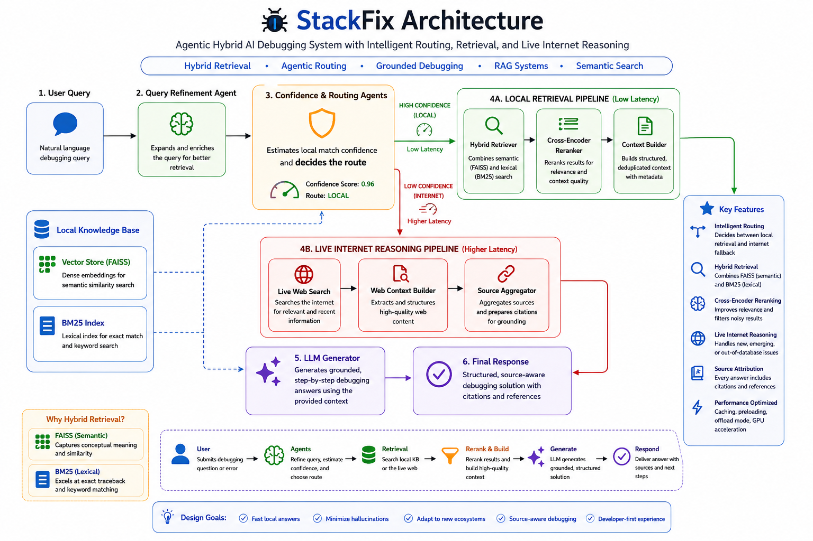
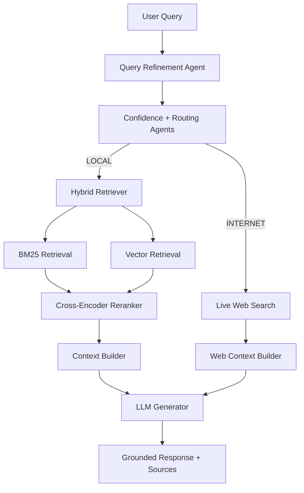

# 🐞 StackFix


[](https://huggingface.co/datasets/Korunil/stackfix)


> Built for realistic developer debugging workflows using hybrid retrieval + intelligent routing.

Focus areas:
`Hybrid Retrieval` • `Agentic Routing` • `Grounded Debugging` • `RAG Systems` • `Semantic Search`

### Agentic Hybrid AI Debugging System with Intelligent Local Retrieval and Live Internet Reasoning


StackFix is a hybrid AI debugging agent that combines local retrieval, reranking, intelligent routing, and live internet reasoning to solve real-world software engineering issues with grounded and source-aware responses.

Instead of relying entirely on live web search or raw LLM generation, StackFix intelligently decides whether a query can be solved using a locally indexed StackOverflow-style knowledge base or whether it should switch to live internet reasoning for newer ecosystem issues.

The system combines:

- Semantic Retrieval (FAISS)
- BM25 Lexical Search
- Cross-Encoder Reranking
- Query Refinement Agent
- Confidence & Routing Agents
- Live Internet Fallback
- Source-Aware Response Generation

to provide grounded, practical, and developer-focused debugging assistance.

---

# 📑 Table of Contents

- [🚀 Overview](#-overview)
- [⚡ Quick Start](#-quick-start)
- [💡 Why StackFix?](#-why-stackfix)
- [✨ Features](#-features)
- [🤖 Agentic Pipeline](#-agentic-pipeline)
- [💻 System Requirements](#-system-requirements)
- [📈 Performance Characteristics](#-performance-characteristics)
- [🏗️ Architecture](#️-architecture)
- [🔀 Flowchart](#-flowchart)
- [🔄 Retrieval Pipeline](#-retrieval-pipeline)
- [📊 Retrieval Quality Snapshot](#-retrieval-quality-snapshot)
- [📂 Repository Structure](#-repository-structure)
- [🎥 Demo Videos](#-demo-videos)
- [🖥️ UI Walkthrough](#️-ui-walkthrough)
- [⚡ Preloading Models](#-preloading-models)
- [⚙️ Configuration Guide](#️-configuration-guide)
- [🧮 Offload Mode](#-offload-mode)
- [🔓 SSL Verification Toggle](#-ssl-verification-toggle)
- [📚 Dataset](#-dataset)
- [🤗 Prebuilt Retrieval Indexes and Full Dataset](#-prebuilt-retrieval-indexes-and-full-dataset)
- [⚡ Performance Notes](#-performance-notes)
- [🏷️ Source Attribution](#️-source-attribution)
- [🧪 Example Queries](#-example-queries)
- [🧰 Tech Stack](#-tech-stack)
- [▶️ Running Locally](#️-running-locally)
- [🧠 Key Insights](#-key-insights)
- [⚙️ Limitations](#️-limitations)
- [🔮 Future Work](#-future-work)
- [🤝 Contributing](#-contributing)
- [📜 License](#-license)
- [⭐ Support the Project](#-support-the-project)
- [🙌 Acknowledgements](#-acknowledgements)

---

# 🚀 Overview

Modern debugging assistants often struggle with:
- hallucinated fixes
- outdated package information
- slow web reasoning
- lack of source grounding
- noisy retrieval results

StackFix addresses this by introducing a hybrid multi-agent debugging pipeline.

The system first attempts to solve queries using local retrieval over a curated debugging knowledge base. If retrieval confidence is insufficient, StackFix dynamically switches to live internet reasoning.

This enables:
- ⚡ fast responses for known issues
- 🌐 internet fallback for emerging ecosystem problems
- 🎯 grounded retrieval-based debugging
- 🧠 intelligent query routing
- 📚 source-aware answers

StackFix is designed around realistic debugging workflows:
- traceback-heavy issues
- dependency conflicts
- framework migration errors
- CUDA/runtime failures
- evolving package ecosystems
- developer search behavior

---

# ⚡ Quick Start

```bash
git clone https://github.com/Korunil/stackfix.git
cd stackfix

pip install -r requirements.txt
```

## Download Prebuilt Indexes

Download FAISS + BM25 indexes from:

[Hugging Face Dataset](https://huggingface.co/datasets/Korunil/stackfix)

Place them inside:

```text
./model_cache/
```

## Launch StackFix

```bash
chainlit run app.py
```

---

# 💡 Why StackFix?

Most AI debugging assistants rely entirely on:
- static retrieval
- pure LLM generation
- or expensive live web search

StackFix introduces an intelligent hybrid approach:

| Problem | StackFix Solution |
|---|---|
| Hallucinated fixes | Grounded retrieval |
| Slow web debugging | Fast local retrieval |
| Outdated package info | Internet fallback |
| Weak ranking quality | Cross-encoder reranking |
| Poor routing decisions | Confidence + Routing Agents |

The result is a debugging assistant that is:
- faster
- cheaper
- more grounded
- and more adaptive to modern software ecosystems.

> Note: The reranker evaluates not only document content, but also titles, tags, and extracted code snippets to improve debugging relevance.

---

# ✨ Features

- 🔀 Intelligent routing between LOCAL and INTERNET modes
- 🧠 Hybrid retrieval using FAISS + BM25
- 🎯 Cross-encoder reranking
- ⚡ Fast local debugging
- 🌐 Live internet fallback
- 🌍 Intelligent GitHub + web retrieval fallback
- 📚 Source attribution
- 🧩 Query refinement pipeline
- 🖥️ Interactive Chainlit UI
- 🚀 GPU acceleration support
- 🧮 Offload mode for lower VRAM systems
- 🔧 SSL verification toggle support
- 📦 Prebuilt FAISS/BM25 index support

---

# 🤖 Agentic Pipeline

StackFix uses lightweight specialized agents internally to improve debugging quality.
The agents are intentionally lightweight and modular, allowing StackFix to separate query understanding, confidence estimation, routing, and response generation into specialized responsibilities.

---

## 🔹 Query Refinement Agent

Expands and enriches debugging queries before retrieval.

Example:
```text
Original Query:
ModuleNotFoundError: No module named 'langchain_huggingface'

Refined Query:
ModuleNotFoundError langchain_huggingface import issue package installation dependency fix
```

Benefits:
- better retrieval recall
- improved semantic matching
- stronger reranking quality

---

## 🔹 Confidence Agent

Calculates how confidently the local knowledge base can answer a query.

Used for:
- local retrieval confidence scoring
- routing decisions
- internet fallback triggering

Example:
```text
Local Match: 0.96
```

---

## 🔹 Routing Agent

Determines whether the query should use:

- LOCAL retrieval
OR
- INTERNET reasoning

based on:
- retrieval quality
- rerank confidence
- semantic relevance

This prevents:
- unnecessary web search
- hallucinated local answers
- poor retrieval grounding

Example:
```text
Route: LOCAL
Local Match: 0.96
```
or

```text
Route: INTERNET
Local Match: 0.42
```

---

# 💻 System Requirements

Recommended:
- Python 3.11
- CUDA-enabled GPU
- 32GB+ RAM
- 10GB+ free storage for indexes

> ⚠️ Loading full retrieval indexes may require substantial RAM depending on FAISS configuration and BM25 size.

Minimum:
- CPU-only supported via OFFLOAD_MODE
- Lower RAM systems may experience slower retrieval/reranking

---

# 📈 Performance Characteristics

| Mode | Typical Latency |
|---|---|
| LOCAL Retrieval | Low latency |
| INTERNET Mode | Higher latency |
| Preloaded Models | Faster warm inference |
| Offload Mode | Reduced VRAM, slower responses |

Performance depends on:
- hardware
- GPU availability
- dataset size
- reranker configuration

---

# 🏗️ Architecture

StackFix intentionally separates retrieval confidence estimation from final response generation.

This allows routing decisions to remain lightweight, interpretable, and modular while preventing expensive internet reasoning for queries that can already be solved locally with high confidence.

Key architectural goals:

* minimize unnecessary internet reasoning
* improve debugging grounding quality
* balance semantic and lexical retrieval
* reduce hallucinated fixes
* optimize retrieval latency for known issues



---

# 🔀 Flowchart



---

# 🔄 Retrieval Pipeline

## LOCAL MODE

1. User submits debugging query
2. Query Refinement Agent expands the query
3. Confidence Agent estimates retrieval confidence
4. Routing Agent selects LOCAL mode
5. Hybrid retrieval fetches:
   - semantic results (FAISS)
   - lexical results (BM25)
6. Results are deduplicated
7. Cross-encoder reranks documents
8. Top documents are converted into structured context
9. LLM generates grounded debugging response
10. Source attribution is attached

---

# 📊 Retrieval Quality Snapshot

| Retrieval Strategy | Strength |
|---|---|
| FAISS Only | Strong semantic similarity matching |
| BM25 Only | Strong exact traceback and keyword matching |
| Hybrid Retrieval | Better overall debugging recall |
| Hybrid + Reranking | Highest contextual relevance and grounding quality |

This hybrid retrieval design helps StackFix balance:
- semantic understanding
- exact error matching
- contextual relevance
- grounded debugging responses

---

## 🌐INTERNET MODE

Activated when:
- local confidence is insufficient
- issue is too recent
- framework/library is evolving
- retrieval quality is weak

Pipeline:
1. Query refinement
2. Routing to internet mode
3. Live web search
4. Context extraction
5. LLM reasoning
6. Structured debugging response

### 🌍 Intelligent External Retrieval

When LOCAL retrieval confidence is low, StackFix performs structured external retrieval using:

- GitHub issue search
- trusted technical web sources
- signal-aware query construction
- heuristic scoring and ranking

The external retrieval pipeline prioritizes:
- framework/package relevance
- traceback overlap
- exact dependency matches
- trusted engineering domains

This helps improve:
- grounding quality
- debugging relevance
- retrieval precision
- modern ecosystem issue handling

---

# 📂 Repository Structure

```text
stackfix/
│
├── app.py
├── config.py
├── cache_store.py
├── preload.py
├── requirements.txt
│
├── core/
│   ├── citation_builder.py
│   ├── query_parser.py
│   ├── query_builder.py
│   ├── query_expander.py
│   ├── github_search.py
│   └── web_search.py
│
├── agents/
│   ├── refinement_agent.py
│   ├── confidence_agent.py
│   └── routing_agent.py
│
├── rag/
│   ├── ingestion.py
│   ├── embedding.py
│   ├── vector_store.py
│   ├── bm25_store.py
│   ├── hybrid_retriever.py
│   ├── reranker.py
│   └── preload.py
│
├── pipeline/
│   └── debug_pipeline.py
│
├── prompts/
│	├── debug_prompt.py
│   ├── fallback_prompt.py
│   ├── system_prompt.py
│   └── system_prompt_detailed.py
│
├── llm/
│	├── llm.py
│   └── generator.py
│
├── memory/
│   └── memory.py
│
├── model_cache/
│   ├── faiss_index/
│   └── bm25_index.pkl
│
├── datasets/
│   ├── raw/
│   │	└── instructions.txt
│   └── processed/
│   	└── sample_stackoverflow.jsonl
│
├── scripts/
│   ├── preprocess_dataset.py
│   └── generate_report.py
│
├── assets/
├── public/
│
├── LICENSE
├── chainlit_en-US.md
└── README.md
```

---

# 🎥 Demo Videos

## 🔹 Quick Demo (Recommended)

Edited showcase version with:
- annotations
- walkthrough
- transitions
- music
- faster pacing

📹 [Watch Quick Demo](./assets/demo-quick-Vertical.mp4)

---

## 🔹 Full Demo (Raw Performance)

Complete unedited walkthrough showing:
- LOCAL retrieval
- INTERNET fallback
- CUDA OOM debugging

📹 [Watch Full Demo](./assets/demo_full.mp4)

---

# 🖥️ UI Walkthrough

## 🔹 Landing Screen


---

## 🔹 LOCAL Retrieval Walkthrough

Known debugging issue solved using local retrieval pipeline.


---

## 🔹 INTERNET Fallback Walkthrough

Recent ecosystem issue automatically routed to internet reasoning.


---

## 🔹 CUDA OOM Debugging Example

GPU memory issue solved using intelligent fallback and debugging reasoning.


---

# ⚡ Preloading Models

StackFix supports preloading:
- embedding models
- rerankers
- vector indexes

This significantly reduces runtime latency.

Example:
```python
preload_retriever()
```

Benefits:
- faster query responses
- avoids cold starts
- smoother demos

---

# ⚙️ Configuration Guide

Main configurable parameters inside `config.py`:

| Parameter | Description |
|---|---|
| `K` | Initial retrieval count |
| `TOP_K` | Final reranked documents |
| `FETCH_K` | Documents fetched before reranking |
| `BATCH_SIZE` | Cross-encoder batch size |
| `BM25_WEIGHT` | Lexical retrieval weight |
| `VECTOR_WEIGHT` | Semantic retrieval weight |
| `ROUTING_THRESHOLD` | Local vs internet routing threshold |
| `DEVICE_RERANKER` | CPU/GPU reranker device |
| `OFFLOAD_MODE` | Enables low VRAM loading |
| `SSL_VERIFY` | Toggle SSL verification |

---

# 🧮 Offload Mode

For lower VRAM systems:

```python
OFFLOAD_MODE = True
```

Benefits:
- reduced GPU memory usage
- CPU offloading support
- smaller GPU compatibility

Tradeoff:
- slower inference

---

# 🔓 SSL Verification Toggle

Useful for restricted enterprise/corporate environments.

```python
SSL_VERIFY = False
```

⚠️ Recommended only for development/testing.

---

# 📚 Dataset

StackFix uses the public StackSample dataset from Kaggle containing:
- programming questions
- accepted answers
- code snippets
- tags
- metadata

Included:
- lightweight sample dataset

Excluded:
- full production-scale dataset due to repository size constraints

### 📊 Dataset Statistics
* **Total Documents:** `1,102,568` Q&A Pairs
* **Quality Threshold:** Only the highest-scored answer per question was retained.
* **Global Average SO Score:** `3.31`
* **Top 10 Tags/Languages:** `javascript`, `java`, `c#`, `php`, `android`, `jquery`, `python`, `html`, `c++`, `ios`

### 🧠 Embedding Architecture
* **Model:** `BAAI/bge-base-en-v1.5`
* **Dimensions:** 768
* **Normalization:** True (Cosine Similarity optimized)
* **Context Strategy:** Questions, answers, and code blocks are merged into a single text block (`retrieval_text`).

### 📥 How to Generate the Indexes
1. Download the Kaggle StackSample dataset from link:[Kaggle StackSample Dataset](https://www.kaggle.com/datasets/stackoverflow/stacksample/data).
2. Place the csv files inside your `./datasets/raw/` directory.
3. Run `./scripts/preprocess_dataset.py` to start generation of `stackoverflow.jsonl`.
4. `chainlit run app.py`. The system will automatically detect the files.

---

# 🤗 Prebuilt Retrieval Indexes and Full Dataset

To avoid regenerating embeddings and indexes locally, StackFix provides prebuilt retrieval artifacts hosted on Hugging Face.

Due to GitHub file size limitations, the full StackFix retrieval artifacts are hosted on Hugging Face.

## 📥 Download

Hugging Face Repository:

[Hugging Face Dataset](https://huggingface.co/datasets/Korunil/stackfix)

Included:

* FAISS vector indexes
* BM25 retrieval index
* Processed StackOverflow retrieval dataset

These prebuilt indexes allow StackFix to start instantly without requiring multi-hour embedding generation.

## 📦 Included Files

| File                  | Description                     |
| --------------------- | ------------------------------- |
| `faiss_index/`        | Prebuilt FAISS vector indexes   |
| `bm25_index.pkl`      | Serialized BM25 retrieval index |
| `stackoverflow.jsonl` | Processed retrieval dataset     |

## 🚀 Usage

Place the downloaded files inside:

```bash
./model_cache/
```

Then launch StackFix normally:

```bash
chainlit run app.py
```

The system will automatically detect and load the indexes.

---

# ⚡ Performance Notes

- Prebuilt FAISS and BM25 indexes dramatically reduce startup time.
- Initial indexing over 1M+ StackOverflow entries can take significant time and storage.
- GPU acceleration is recommended for embedding generation and reranking.
- Offload mode enables operation on lower VRAM systems.

---

# 🏷️ Source Attribution

Responses include source grounding and attribution.

Example:

```text
📚 Sources:
[1] TypeError: Can't convert 'int' object to str implicitly
```

Benefits:
- transparency
- trustworthiness
- grounded debugging

---

# 🧪 Example Queries

## LOCAL Retrieval Example

```text
I am getting TypeError: can only concatenate str (not "int") to str when trying to print a user's age with a string. How do I fix this?
```

---

## INTERNET Fallback Example

```text
I just upgraded my pipeline and I am getting ModuleNotFoundError: No module named 'langchain_huggingface'. How do I fix this?
```

---

## GPU Debugging Example

```text
I am getting RuntimeError: CUDA out of memory while training my PyTorch model. How do I reduce GPU memory usage?
```

---

# 🧰 Tech Stack

| Component | Technology |
|---|---|
| UI | Chainlit |
| Framework | LangChain |
| Vector Search | FAISS |
| Lexical Search | BM25 |
| Reranking | SentenceTransformers |
| Embeddings | HuggingFace |
| Language | Python |
| Inference | PyTorch |

---

# ▶️ Running Locally

## 1️⃣ Clone Repository

```bash
git clone https://github.com/Korunil/stackfix.git
cd stackfix
```

---

## 2️⃣ Install Dependencies

```bash
pip install -r requirements.txt
```

---

# ⚡ Recommended Setup (Fast Startup)

Download prebuilt FAISS + BM25 indexes from:

[Hugging Face Dataset](https://huggingface.co/datasets/Korunil/stackfix)

Place the downloaded files inside:

```bash
./model_cache/
```

Structure example:

```text
model_cache/
├── faiss_index/
└── bm25_index.pkl
```

This avoids regenerating embeddings locally and dramatically reduces setup time.

---

# 🛠️ Full Local Index Generation (Optional)

If you want to build the indexes yourself:

## 1. Download StackSample Dataset

Download from:

[Kaggle StackSample Dataset](https://www.kaggle.com/datasets/stackoverflow/stacksample/data)

---

## 2. Place CSV Files

Move the downloaded CSV files into:

```text
./datasets/raw/
```

---

## 3. Generate Processed Dataset

```bash
python ./scripts/preprocess_dataset.py
```

---

## 4. Launch StackFix

```bash
chainlit run app.py
```

The system will automatically:

* generate embeddings
* build FAISS indexes
* build BM25 indexes
* cache retrieval artifacts


---

# 🧠 Key Insights

## Why Hybrid Retrieval?

Semantic search alone may:
- miss exact error strings
- struggle with tracebacks

BM25 alone may:
- miss conceptual similarity

Combining both improves:
- recall
- robustness
- debugging quality

---

## Why Cross-Encoder Reranking?

Initial retrieval often contains noisy candidates.

Cross-encoder reranking significantly improves:
- contextual relevance
- grounding quality
- response precision

---

## Why Intelligent Routing?

Not every debugging problem should use live internet reasoning.

Local retrieval provides:
- speed
- determinism
- reduced hallucination risk

Internet fallback handles:
- evolving frameworks
- recent package changes
- new ecosystem issues

---

# ⚙️ Limitations

- Internet mode depends on external web quality
- Retrieval quality depends on dataset coverage
- Very recent ecosystem issues may lack grounding
- Large-scale indexing requires significant storage
- Some fixes may still require manual verification

---

# 🔮 Future Work

- VSCode extension
- Docker deployment
- Streaming responses
- GitHub issue ingestion
- Better traceback parsing
- Multi-hop debugging
- Dependency conflict detection
- Agentic debugging workflows
- Query expansion improvements
- GPU optimized FAISS indexes
- Better code-aware reranking

---

# 🤝 Contributing

Contributions, ideas, and feedback are welcome!

Suggested areas:
- retrieval improvements
- reranking optimization
- dataset quality
- UI enhancements
- evaluation benchmarks
- routing logic

---

# 📜 License

Licensed under the Apache 2.0 License.

---

# ⭐ Support the Project

If you found this project useful:

- Star the repository
- Open issues
- Suggest improvements
- Share feedback

# 🔗 Repository
https://github.com/Korunil/stackfix.git

---

# 🙌 Acknowledgements

Built using open-source tooling from:
- LangChain
- Chainlit
- FAISS
- Sentence Transformers
- Hugging Face
- PyTorch
